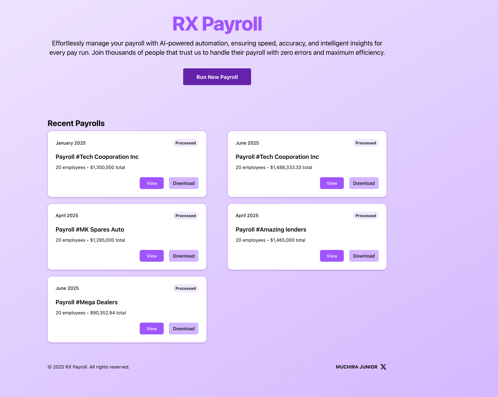
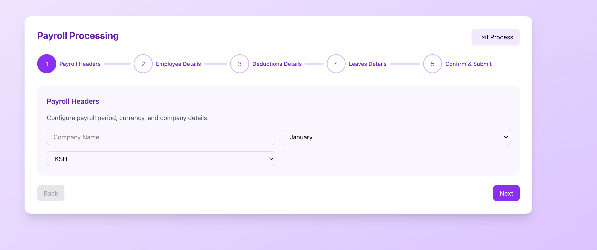
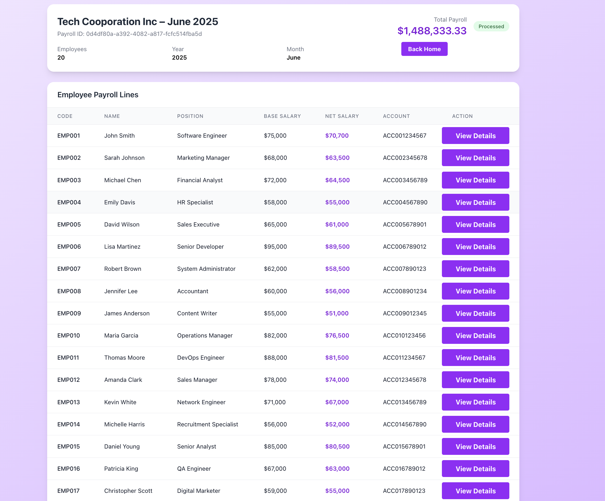
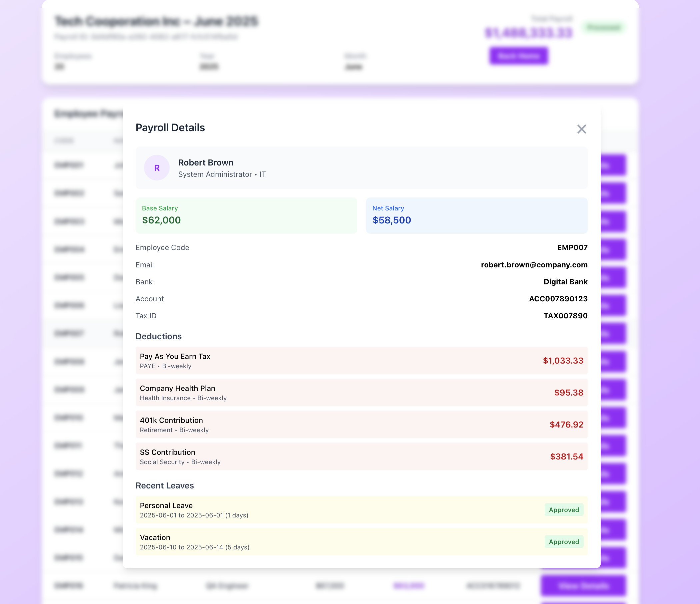

# RX Payroll

AI‑powered payroll runner built with Next.js, Supabase, and OpenAI. Generate accurate payrolls from structured inputs, persist results in Supabase, and inspect per‑employee details — all deployed on Vercel.

## Screenshots









## Features

- AI payroll generation using OpenAI (`gpt-4o-mini`) from your employees, deductions, and leaves data
- Persistent storage in Supabase tables for payroll headers and lines
- Modern UI built on Next.js App Router with anonymous auth for quick access
- Detailed view per employee with totals and status indicators

## Tech Stack

- Next.js 16 (App Router)
- Supabase JS SDK (`@supabase/supabase-js`)
- OpenAI SDK (`openai`)
- TypeScript

## Quick Start

1. Prerequisites: Node.js 18+ and a package manager (`npm`, `pnpm`, `yarn`, or `bun`)
2. Install dependencies:

   ```bash
   npm install
   ```

3. Configure environment variables by creating a `.env` file in the project root:

   ```bash
   OPENAI_API_KEY=your-openai-api-key
   SUPABASE_PROJECT_URL=https://your-project.supabase.co
   SUPABASE_ANON_KEY=your-supabase-anon-key
   ```

   Never commit real secrets. `.env*` files are already ignored by `.gitignore`.

4. Run the app locally:

   ```bash
   npm run dev
   ```

   Visit `http://localhost:3000`.

## Environment Variables

- `OPENAI_API_KEY`: OpenAI API key
- `SUPABASE_PROJECT_URL`: Supabase project URL (e.g., `https://xyzcompany.supabase.co`)
- `SUPABASE_ANON_KEY`: Supabase anon key for client access

These are read in `app/utils/utils.ts` to initialize clients.

## How It Works

- Supabase and OpenAI clients are created in `app/utils/utils.ts:5` and `app/utils/utils.ts:7`.
- Payroll generation happens in `app/utils/services.ts:61` (`runPayroll`), which:
  - Calls OpenAI with your provided inputs (employees, deductions, leaves)
  - Parses the JSON response into a `Payroll` object
  - Inserts a payroll header into the `payroll` table and lines into `payroll_lines`
- The Home page lists recent payrolls and starts new runs from `app/page.tsx:23`.
- The details page for an individual payroll is implemented in `app/payroll/[id]/page.tsx:7`.

## Data Inputs

You can provide structured inputs directly in the UI. Sample CSV files are available:

- `public/employees_sample.csv`
- `public/deductions_sample.csv`
- `public/leaves_sample.csv`

Use these as references for formatting employee, deduction, and leave data.

## Supabase Setup

1. Create a Supabase project and copy the Project URL and anon key into `.env`.
2. Create tables that match the fields your payroll JSON uses. At minimum:

   `payroll`

   - `uuid` (text, primary key)
   - `month` (text)
   - `company` (text)
   - `year` (int)
   - `employee_count` (int)
   - `total` (numeric)
   - `status` (text)

   `payroll_lines`

   - `emp_code` (text)
   - `emp_name` (text)
   - `department` (text)
   - `position` (text)
   - `base_salary` (text or numeric)
   - `net_salary` (text or numeric)
   - `bank_account` (text)
   - `bank_name` (text)
   - `email` (text)
   - `tax_id` (text)
   - `payroll_uuid` (text, foreign key to `payroll.uuid`)

If you include nested arrays (e.g., `deductions`, `leaves`) in your line items, consider JSONB columns or separate tables for those.

```SQL 

create table public.payroll (
  id bigint generated by default as identity not null,
  uuid text null,
  month text null,
  company text null,
  year bigint null default '2025'::bigint,
  employee_count bigint null default '0'::bigint,
  total numeric null default '0'::numeric,
  status text null,
  created_at timestamp with time zone not null default now(),
  updated_at timestamp without time zone null default now(),
  can_delete boolean not null default true,
  constraint payroll_pkey primary key (id),
  constraint payroll_uuid_key unique (uuid)
) TABLESPACE pg_default;


create table public.payroll_lines (
  id bigint generated by default as identity not null,
  emp_code text null,
  emp_name text null,
  department text null,
  position text null,
  base_salary text null,
  net_salary text null,
  bank_account text null,
  bank_name text null,
  email text null,
  tax_id text null,
  deductions jsonb null default '[]'::jsonb,
  leaves jsonb null default '[]'::jsonb,
  payroll_uuid text null,
  created_at timestamp with time zone not null default now(),
  constraint payroll_lines_pkey primary key (id),
  constraint payroll_lines_payroll_uuid_fkey foreign KEY (payroll_uuid) references payroll (uuid) on update CASCADE on delete CASCADE
) TABLESPACE pg_default;

```

- Remember to enable rls policy and anon signin in your supabase setup

## Deployment (Vercel)

1. Push this repository to GitHub
2. Import the project on Vercel
3. In Vercel Project Settings → Environment Variables, add:
   - `OPENAI_API_KEY`
   - `SUPABASE_PROJECT_URL`
   - `SUPABASE_ANON_KEY`
4. Deploy

## Scripts

- `npm run dev`: start local dev server
- `npm run build`: production build
- `npm run start`: start production server
- `npm run lint`: run ESLint

### Generate report on supabase
```md
   i want a database function for report on number of number of payroll run, number of employees, and total costs that returns { payroll_count:2, total_employees:50, total_cost:8000} function name get_payroll_report
```

## Notes

- Anonymous auth is used on first load to keep onboarding friction low (`app/layout.tsx:26`).
- Do not store or log secrets; use environment variables and platform secret managers.
